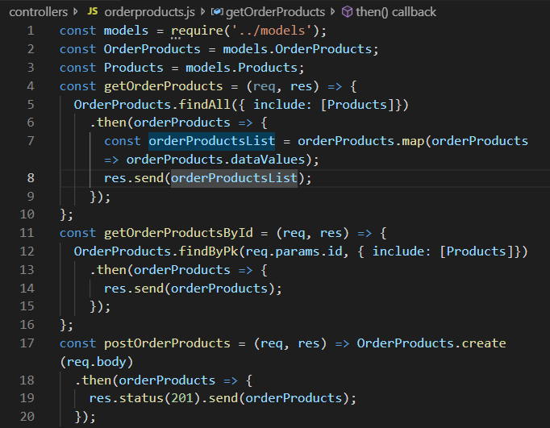

# Burger Queen API
O projeto é um sistema para pequeno restaurante, onde é possível receber pedidos e enviá-los para a cozinha. A API, neste caso, é um servidor web, que deve gerenciar as requisições recebidas e produzir respostas àquelas requisições que serão enviadas de volta para o cliente. A API foi criada com Node.js, a partir do [link para a documentação](https://documenter.getpostman.com/view/1721181/RWgozeom?version=latest) que especifica o comportamento esperado.

### Objetivos de aprendizagem
O principal objetivo de aprendizagem é ganhar experiência com o Node.js como uma ferramenta para desenvolver aplicações de servidores, junto com uma série de ferramentas comuns usadas neste tipo de contexto (Express como framework, MongoDB ou MySQL como banco de dados, ferramentas de autenticação, etc).

A proposta consiste em construir um servidor web que deve servir JSON via HTTP e implementá-lo em um servidor na nuvem.

Para completar o projeto, é necessário estar familiarizado com conceitos como rotas (routes), URLs, HTTP e REST (verbs, request, response, headers, body, status codes...), JSON, JWT (JSON Web Tokens), conexão com banco de dados, variáveis de ambiente, deployment, etc.

### Critérios
Segundo a documentação, a API deve conter os seguintes endpoints:

> **/users**
>
> GET /users
>
> GET /users/:uid
>
> POST /users
>
> PUT /users/:uid
>
> DELETE /users/:uid

> **/products**
>
> GET /products
>
> GET /products/:productid
>
> POST /products
>
> PUT /products/:productid
>
> DELETE /products/:productid

> **/orders**
>
> GET /orders
>
> GET /orders/:orderid
>
> POST /orders
>
> PUT /orders/:orderid
>
> DELETE /orders/:orderid

